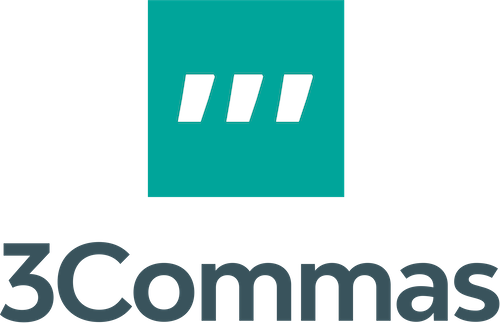
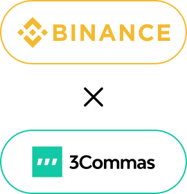

# 3commas

> Me gusta presentar 3commas como una web que ofrece **"TODO en UNO"**.

Con 3commas podemos manejar todas las cuentas de los exchanges desde una misma pantalla. Basta de entrar y salir de sesiones, basta de contraseñas múltiples. La interfaz de esta plataforma te permite hacer trading de forma inteligente, y además, podes activar (o desactivar) robots automáticos, muchos de ellos gratuitos -que vos mismo configuras al máximo, otros se pueden comprar para que respondan a señales de sitios web que se dedican a análisis del mercado.

La interfaz está orientada a usuarios novatos, sin embargo, aún si eres nuevo en el mundo de las criptomonedas, vas a necesitar una mano. Por ello, **estoy aquí dando inicio al curso gratis sobre 3commas en español**. Ayudame con la difusión de este enlace, así más personas pueden nutrirse de estos conocimientos sin pagar nada.

## Qué es

> Es una plataforma web que lleva buen tiempo y reputación en el mercado. Puedes comprobarlo haciendo tu propia investigación.

En sí misma, **3commas es una plataforma integradora para operar con criptomonedas**, ya sea HODL (comprar para mantener a largo plazo) o bien trading. La plataforma en sí misma NO guarda tus criptomonedas, sino que se conecta a las demás empresas de intercambio ofreciendote una experiencia distinta y simplificada.

Posee apps oficiales para móviles. Si eres nuevo, te recomiendo comenzar dominando el sitio web.

En este curso de LocademiaCripto, las capturas de pantalla y los enlaces de referencia serán para profundizar el sitio web, y sacarle el máximo jugo posible.

## Por qué

Si estás decidido a invertir poco capital en el mundo de las criptomonedas, en el tema TRADING, te habrás dado cuenta que tienes que vivir online, o bien estar muy cerca de los gráficos. Si tienes más de una cuenta en Exchanges, te será dificil llevar el control de tus movimientos. ¿Cuánto estás ganando o perdiendo en Binance? ¿Y en Kucoin?

Con 3commas, **todos los exchanges estan en una sola página web**. De hecho, puedes ver en tiempo real cómo te está yendo con cada operación, sin importar si es SPOT, Futuros, o un Grid Bot. Sin importar en qué exchange estés trabajando.

En este curso cubriré todo lo que puedes hacer con 3commas, y cómo hacerlo.
Sumándote a tu primer plan anual, [te regalo 50% de descuento en el plan que elijas](https://3commas.io/?c=cripto), más consultas ilimitadas conmigo a través de Telegram.

## Empezar

Paso por paso, más simple de lo que crees!

1. Me seguis en Twitter: https://twitter.com/LocademiaCripto y en YouTube: https://youtube.com/LocademiaCripto
2. Me envías un mensaje privado por [Telegram @WaLddo](https://t.me/waLddo), que te vas a sumar a 3commas con esta invitación exclusiva del 50% de descuento en tu primer año.
3. Crear cuenta en 3commas; aquí te doy dos opciones más:
   - Puedes crear la cuenta sin pagar nada con [este enlace](https://3commas.io/?c=cripto), y tienes 3 días gratis con súper poderes (plan PRO)
   - Puedes crear la cuenta sin pagar nada con [este enlace](https://3commas.io/?c=cripto), y tienes 50% de descuento en tu primer plan anual (el plan que elijas)

Los siguientes pasos, creación de cuenta, conectar la exchange, y comenzar a operar todo te guío a través de sesiones semanales, particulares, uno a uno conmigo. Nadie más, sin publicidad, sin engaños, y todo en español.

## BONUS PACK: 3Commas + Binance :id=binance {docsify-ignore}

Si no tienes cuenta en Binance, te ofrezco un BONUS Pack de descuentos exclusivo:

- Invitación Plus de LocademiaCripto a Binance: https://bit.ly/LocaBinance
- Invitación Recargada a 3commas: https://bit.ly/escuelita3commas

Si usas este pack (ambos enlaces), y creas tus cuentas, te ayudo paso por paso a unirlas para disfrutar de todo el poder de Binance a través de herramientas de trading inteligente, y BOTs automáticos que ofrece 3Commas. Me envías un mensaje privado por [Telegram @WaLddo](https://t.me/waLddo) para coordinar conmigo las clases particulares a través de Meet o Zoom, que **incluye clases gratis para dominar Binance y complementar con 3Commas**.

## Escuelita 3Commas

El curso es particular, es decir, tú y yo. Nadie más. A tu ritmo.
Son clases de 1 hora, una vez por semana. El contenido lo define el usuario, lo que quiera aprender debe comunicarmelo primero.

- ¿Cómo coordinar clases? Por privado en [Telegram @WaLddo](https://t.me/waLddo)
- ¿Cuánto cuesta? Todo dependerá de tu [pantalla de "Ajustes" de tu 3Commas](https://3commas.io/es/users/profile?c=cripto), si el código de referido que tienes cargado es `cripto` (así como está escrito aquí), y te has sumado a un plan anual por primera vez, entonces no tienes que pagar nada por 10 clases. Si el código es `cripto` y no deseas pagar ningún plan aún, podemos conversar el costo de cada clase.

Si no tienes código `cripto` y no deseas cambiarlo, entonces que te de clases el que te refirió ;-) 

### Curso 3Commas gratis
En la lista de videos de YouTube: "[3Commas desde cero](https://www.youtube.com/playlist?list=PLzQ2nY1vA4kKTUpevnVk98pX1VX3E8ZuE)" se publican video tutoriales informativos con contenido muy importante, pero no necesariamente es el mismo contenido que se da a quienes obtienen el beneficio de las clases vía estuelita de 3Commas.

#### RoadMap de la lista en YouTube :id=youtube

Indice de temas a ver en la lista de YouTube (cuando tengan enlaces, es que los videos están publicados y listos para disfrutar)

- [3Commas en Español: Bonus Pack](https://youtu.be/tnvAPUgtKYI)
- [3Commas: Registro y configuración](https://youtu.be/oDMwU_26cqI)
  - Cómo me registro
  - Qué configuro después (seguridad)
- [Por qué usar 3commas](https://youtu.be/11gM2pkE82M)
- [Menú 3Commas, parte por parte](https://youtu.be/BkXJUdzxd7I)
- Cómo elegir el plan que es adecuado para mi
- Características
  - Bots
    - [Copiar un bot](https://youtu.be/ECC2wJP3pJM)
    - Configuración
  - Smart Trading (trading inteligente)
  - Grid Bots
- Señales profesionales de entrada/salida para los bots

>Si ya tenes cuenta en 3Commas y queres recomendar o solicitar un tema, tenes dudas, algún problema, podes [comentar aquí](https://youtu.be/tnvAPUgtKYI) y se te responderá a la brevedad; y si es algo urgente, contactame por [Telegram @WaLddo](https://t.me/waLddo).