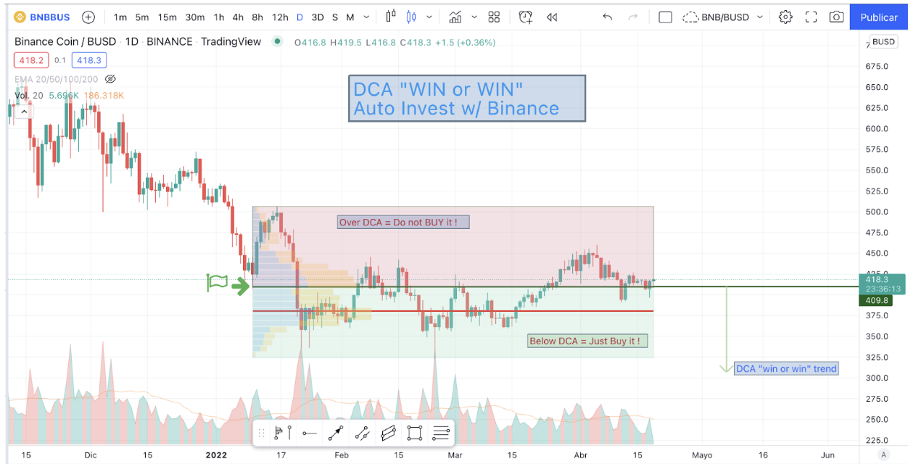

# Trading

## Cómo aprender desde cero

>Trading, trading, trading ... 

Vas a encontrarte con gente que dice que esto es el casino, que son apuestas, etcétera. Personas sin conocimientos (y sin ganas de aprender) que lo único que hace es desparramar desinformación, confundir y crear miedo. El AZAR es una cosa, una probabilidad. Lotería, casino, son lugares de AZAR. Sí, podes "estudiar" cómo se tiran cartas, y bajar la probabilidad de error, y aumentar la probabilidad de que "ganes" en el casino. Pero eso sigue siendo AZAR. En el trading, compras una bic ahora (en Argentina), y la vendes más cara en "x" tiempo después. PUNTO, hiciste trading y sacaste ganancia, no hay AZAR. ¿Se entiende la diferencia? 🤔

El trade, es comprar y vender. Punto. No hay mucha ciencia (aunque, sí, la hay). Puedes usar miles de estrategias para el trading, de gente que ha probado muchas veces -y las comparte (o las vende), o la propia donde vos estudias el comportamiento de un activo en el tiempo, y compras en determinado momento, esperando a que el mercado se comporte a tu favor para luego vender.

El internet explotó las capacidades de los usuarios (abrió ojos), aumentó el interés y te permite no depender de "un" broker, podes si queres conocer a cualquier broker en el mundo, y participar de cualquier mercado de valores del mundo. (Nosotros como somos monos en Argentina, y vivimos en la época de las cavernas, con las regulaciones económicas, no tenemos muchas libertades de hacer lo que queramos con nuestro dinero, pero hay opciones).

¿Qué es un broker, o agente de bolsa? Es una persona que estudió, rindió un examen, y está registrado como agente para poder "trabajar/operar" en el mercado de valores. Ah, sí, también pagó para eso. Todo en este mundo regulado es $$$. Comisiones, IVA, y gastos. Y AFIP, y UIF, por supuesto. Todo está "bajo lupa" (siempre que metas guita fuerte, obvio que si entrás al MERVAL y compras acciones por 200 pe, no te va a pasar nada).

ANTES de la decisión de "haré trading en este o aquel broker, con esta o aquella acción/cripto, etcétera", está el tema ANÁLISIS. Se compone de dos ramas principales. Análisis Técnico y Análisis Fundamental. Todo lo que es análisis es un requisito para el trading.

Explico todo, porque esto también es TRADING. Hacer trading es todo, porque tenes que saber cuándo (el análisis define esto), dónde y a quién comprarle el activo, y después de "x" tiempo, cuándo, dónde y a quién venderle lo que compraste. Todo forma parte del "costo" de la operación, porque si usas el broker "x", capaz cobra más que otro broker.

Si te vas al mercado no regulado de las criptomonedas, el riesgo es otro, y las ganancias son otras. No hablaré de ésto acá, porque estamos en Merval, si vas por el trading en criptos, te recomiendo ir a r/LocademiaCripto.

Volviendo al grano: "Cómo aprender trading nivel principiante"

1. Hacete una cuenta GRATIS en [TradingView](https://bit.ly/LocaTrading)
2. Elegí el activo que vayan a operar
3. Definan lo básico de Análisis Técnico (temporalidad, tendencias, soportes, etc)
4. Elijan 1 día dónde comprarían y a qué precio, marquen eso en el gráfico.
5. Semanalmente estudien comportamiento del activo. Estudien también lo fundamental, si es un acción, de qué empresa, qué está haciendo la empresa. El Análisis Fundamental es crítico aunque nadie lo diga.
6. Después de "x" temporalidad (eso lo define el trader), deben vender para ver "ganancias", así que fijen cuándo venderían, y con tradingView ven cuánto ganarían (% de ganancia), por supuesto deben restarle las comisiones del broker donde operarían, comisiones, impuestos, etcétera.
7. Felicitaciones, están haciendo trading simple, y sin invertir ni un centavo!

Repetir del punto 2 al 6, muchas veces para corregir la estrategia personal, estudiar indicadores técnicos (rama del análisis técnico), y depurar tu propia estrategia. MUCHAS veces. Cada activo se comportará distinto, depende del mercado, y de qué sea el activo bajo estudio.

### Recomendaciones

Algunas recomendaciones en base a mi experiencia personal:

- Mantenete MUY lejos de FOREX, y binarias. A mi modo de ver, pérdida de tiempo.
- Si alguien te menciona "futuros", es para cuando tengas al menos 1 año de trading, constante, y que manejes bien la plataforma donde operamos. NO entres por más que te prometen ganancias jugosas y tentadoras. Podes estudiar los activos de futuros en TradingView, y analizar cómo te va con eso, se comporta distinto y los COSTOS aumentan ahí, porque podrías "ganar" más rentabilidad. Cuidado. De nuevo repito, si tienes menos de 1 año de trading, NO hagas nada en futuros.
- No pagues cursos, ni pavadas. Todo está en la red. Eso sí, requiere HORAS CULO como se decía antes, es decir, sentarse y estudiar. El conocimiento NO entra por ósmosis ni por ver videos en internet.
- Comprar libros? Mmm depende de vos. Yo no puedo, siento que pierdo valioso tiempo que podría dedicar en otro análisis, o estudio. Sí hay libros en PDF, o gente que comparte lo que ha aprendido de libros, interpretaciones, eso sirve, pero de nuevo, depende de cada uno.
- La práctica hará al maestro.
- No busques hacerte millonario. El peor error de los traders (inclusive los expertos) es creer que con una operación se harán millonarios en cuestión de horas o días. Respeta el tiempo.
- No hagas trading con dinero prestado.
- No alardees sobre el trading. La gente pensará que te metiste en alguna pelotudez de "ser tu propio jefe" o pasarás a escuchar el tema del AZAR, casino, etcétera.
- Te deseo buen augurio y motivación, la vas a necesitar ;-)

## Estrategia DCA

En el trading, cuando compramos un activo a precio 100 por ejemplo, si después el activo baja a precio 90, vamos "perdiendo". Pues ahora podríamos comprar el activo a 90, y nosotros pagamos 100. Deberíamos esperar a que suba a 110 para vender lo que compramos a 100, es lógico ¿verdad?

La estrategia DCA es "Dollar cost average", es el promedio del costo (en dólares). Persigue una suerte de lógica matemática, y es muy fácil de entender. Siguiendo el ejemplo anterior, habíamos comprado a 100, y el precio al reducirse a 90, podemos volver a comprar. No vendemos en pérdida, sino que tomamos más capital y compramos de nuevo. Nuestro precio DCA no será 100, sino que el precio de compra promedio, baja. Suponiendo que baja el mismo activo a 50, y volvemos a comprar, entonces el precio promedio de compra, vuelve a bajar. Si el precio del activo sube a 90 nuevamente, y ese precio está arriba del DCA, tenemos la opción de vender nuestros activos (la totalidad), y salir ganando dinero.

### Auto Inversión

Con Binance Auto-Invest podemos comprar de forma automática y de manera regular las criptomonedas. Esto permite promediar el precio de compra, obteniendo así lo que se conoce como estrategia DCA. Sin embargo, como está el sistema actualmente configurado, comprará por arriba del precio promedio, aumentando de esta forma el riesgo de pérdida por volatilidad de la moneda que estemos comprando. Y esto es un problema! Los usuarios no ven con buenos ojos cuando el resultado del plan de inversión son números rojos.

!> Esta solución se la presenté a Binance para ver si mejoran el sistema de Auto-Inversión. Por el momento no han creado ninguna mejora al respecto. El otro sistema donde ví que tienen similar estrategia de auto-inversión, es [3commas](https://bit.ly/3criptos), aunque ellos le llaman [DCA Bot](https://bit.ly/3criptos), por el momento de Bot no tiene nada, ya que compra regularmente de forma automática días determinados, sin importar a qué precio esté el activo.

#### Propuesta de Solución: Win or Win
Para un sistema que invierta automáticamente, usando DCA “Win or win”, el sistema debe comprar únicamente en el precio promedio o bien por debajo de éste. De esta forma, cada vez que el precio de la criptomoneda baje, se podrá comprar. Si el precio de la misma está por encima del precio DCA del usuario, no debe comprar (salvo que el usuario así lo decida).

El usuario podrá crear un plan de inversión automática con éste método, o bien desactivarlo y comprar siempre que la frecuencia elegida se cumpla.

#### Beneficios
- Aumenta significativamente las posibilidades de ganar contra la volatilidad
- Disminuye significativamente la probabilidad de ver números rojos en el plan de inversión (en el resúmen)
- Los usuarios se van a ver más atraídos por un plan de inversión pensado para HODL que permite comprar cuando el precio baja (y no cuando el precio sube).
- Compra cuando el precio baja, NO compra cuando el precio sube.

**Análisis Gráfico** 

Suponiendo que estamos con Auto-Invest en Binance, para #BNB:

Si el 10 de Enero creamos nuestro plan de auto inversión con Binance, habremos comprado BNB aproximadamente en 409 dólares. Si el precio está por arriba de ese valor, el sistema NO debe comprar. Si, en cambio, está por debajo, el sistema debe comprar.

Esto hará que nuestro DCA promedio sea menor con cada compra que el sistema realiza automáticamente.

Cuando el precio de BNB sea superior al DCA, el sistema NO debe comprar, por más que la periodicidad se cumpla. El usuario puede desactivar el método “win or win” si lo desea., pero ya será una decisión del usuario (no del sistema).
