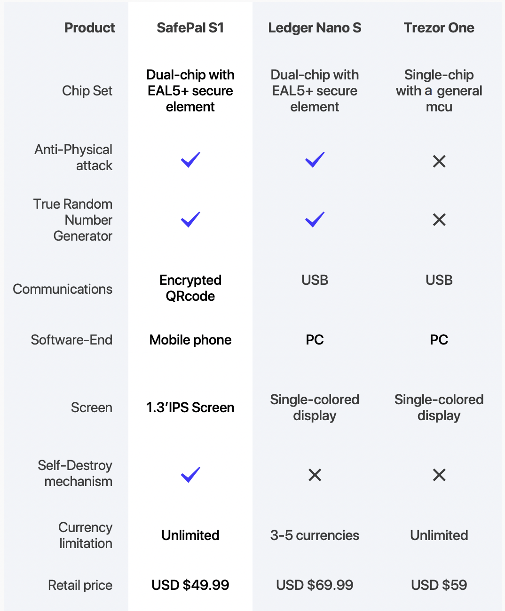

# Wallets

> Wallets o "Billeteras" aunque ... *Las llamemos por su denominación en inglés.*

Las Wallets son las "billeteras o carteras", han ido ganando terreno y pronto nadie usará un monedero físico, ni en la cartera, ni en el bolsillo ni en la mochila. _Se acabó el mundo físico!_ ;-)

La custodia propia es una idea exigente que requiere de una estrecha unión entre la facilidad de uso y una máxima seguridad.

El "**sé tu propio banco**" se logra cuando entiendes que puedes almacenar tu dinero en tu propio cofre a prueba de todo., tu propia billetera inmortal, perfectamente segura por donde lo analices. ¿Por qué confiar en la base de datos de una empresa bancaria o financiera? ¿Por qué pagarle por administrar tu dinero a un tercero? ¿Para qué prestar tu dinero? Todo lo que hacen los bancos, puedes hacerlo tú mismo, tú mismo -como persona, puedes administrar todos tus fondos, decidir qué hacer, sin tener que pagarle comisiones a nadie, ni pedirle permiso a nadie, ni pagar impuestos por tu propio dinero.

Si tienes activos cripto, necesitas un lugar seguro en el que guardar tus fondos. Probablemente ya sepas que no deberías guardarlos en un exchange (empresa de intercambio de criptomonedas) y que una billetera de hardware es la mejor forma de proteger tus claves privadas.

Cuando se trata de billeteras de hardware, puede ser complicado elegir la opción más adecuada. Pero estamos aquí para ayudarte. En este artículo describimos los aspectos más importantes que hay que tener en cuenta y te enseñamos por qué los dispositivos Ledger son la mejor solución.

Cuando tienes cripto, lo que realmente tienes es una [clave privada](#llaves-privadas) que te da acceso a tus monedas. Nadie más debe tener el control de esta clave, por lo que tienes que mantenerla segura.

## ¿Qué wallet elegir?

Te recomiendo leer: [¿Billeteras para Criptomonedas?](https://www.locademiacripto.com/p/billeteras.html)

Es muy importante que comprendas los conceptos que se explico en ese artículo.
Si algo no se entiende, por favor, [dímelo ahora](https://bit.ly/preguntasCripto).

## Llaves privadas

>Sinónimos: "seeds", "palabras clave", "keywords", "llaves privadas".

Cuando estamos en presencia de criptomonedas, cualquiera sea, trabaja con una tecnología de cadena de bloques. En estos bloques, dentro del libro (registro), su información está encriptada bajo una seguridad extrema. Esa encriptación posee una "llave" única, una clave privada capaz de descifrar y abrir el candado para dar acceso a su bloque dentro del libro, y así darle acceso a sus criptomonedas.

!> **PELIGRO:** Si usted, comparte sus "palabras clave" ya sea a una persona física, a una persona virtual, o bien en un sitio web, la persona que recibe esta información puede en menos de un minuto, entrar a su billetera, sacar todos sus fondos, y no habrá forma de recuperar dicho dinero.

La mejor analogía para representar este tema, es que pienses que estás regalandole una copia exacta de las llaves de tu casa, a un desconocido. ¿Para qué lo haces? Si después el descocido va a tu casa, entra y la vacía, no podrás culpar a la policía, ni al banco, ni a la aseguradora de tu hogar, porque tú mismo le dista las llaves de tu casa a un desconocido.

## SEGURIDAD

Una vez leí un usuario que decía:
>Es muy peligroso dar la dirección de la walet privada a un desconocido porque te la pueden hackear 
>Es recomendable dar dirección de un exchange

Esto no es verdad. Dar una "dirección de wallet" no es peligroso, ni inseguro.
Le consulté al usuario a qué se refería y me explicó que conoce personas que han recibido criptomonedas en sus wallets, y que después han sido hackeadas al querer usar esas criptomonedas. He ampliado este tema en el apartado de [ESTAFAS:Monedas](../estafas.md#monedas), recomiendo darle una leída.

## Hardware Wallets :id=cold

> Billeteras físicas, no conectadas a Internet, seguridad extrema.

Para personas más conservadoras que quieren guardar sus criptomonedas de forma fuera del internet, existen las billeteras frías, conocidas en inglés como _cold wallets_. 

En el mercado hay representantes destacados:

- [Ledger](https://shop.ledger.com/es/?r=a7f16c4a50c8)
- [SafePal](https://shop.safepal.io/products/safepal-hardware-wallet-s1-bitcoin-wallet?ref=locademia)
- Trezor

### Ledger

— Una billetera de hardware Ledger, junto con la aplicación Ledger Live, es la mejor solución para proteger, almacenar y gestionar tus activos cripto.
— Las billeteras de hardware Ledger cuentan con seguridad líder del sector para mantener tus activos cripto seguros en todo momento.
— La aplicación Ledger Live es la ventanilla única para tus cripto. Compra, vende, cambia y haz crecer tus activos de una forma segura con nuestros socios
— Con Ledger puedes proteger, guardar y gestionar más de 1800 activos cripto.
— Ledger fabrica las billeteras de hardware más populares del mundo, con más de 3 millones de ventas.
— ¿Por qué elegir Ledger? Porque proporcionamos el mejor producto para mantener tus cripto seguras.

Una billetera de hardware Ledger, junto con la aplicación Ledger Live, es la mejor forma de proteger tus fondos. Tu billetera de hardware mantiene protegida tu clave privada en todo momento en un chip seguro certificado. Nadie puede acceder a ella salvo tú.

#### Ledger Live

Las billeteras de hardware Ledger incluyen la aplicación Ledger Live. Puedes gestionar más de 1800 monedas y tokens con la aplicación directamente desde tu smartphone o equipo. Te da acceso a distintos servicios cripto.

Puedes comprar Bitcoin, Ethereum, Bitcoin Cash, Dash, USDT y Stellar directamente desde Ledger Live con los socios de la empresa Ledger. Con Ledger Live también podrás vender Bitcoin por divisas fiduciarias cuando lo necesites.

Gracias a su interfaz clara y sencilla, Ledger Live te permite consultar tu saldo actual y gestionar todas tus transacciones. Así, tendrás un control total en todo momento.

### SafePal

¿Por qué recomiendo SafePal?

De las tres alternativas es la más barata, y posee versatilidad exclusiva.
Permite la sincronización instantánea a la app móvil, lo que su competencia aún no permite.
*Próximamente haré un video donde muestro todo sobre esta herramienta.*

