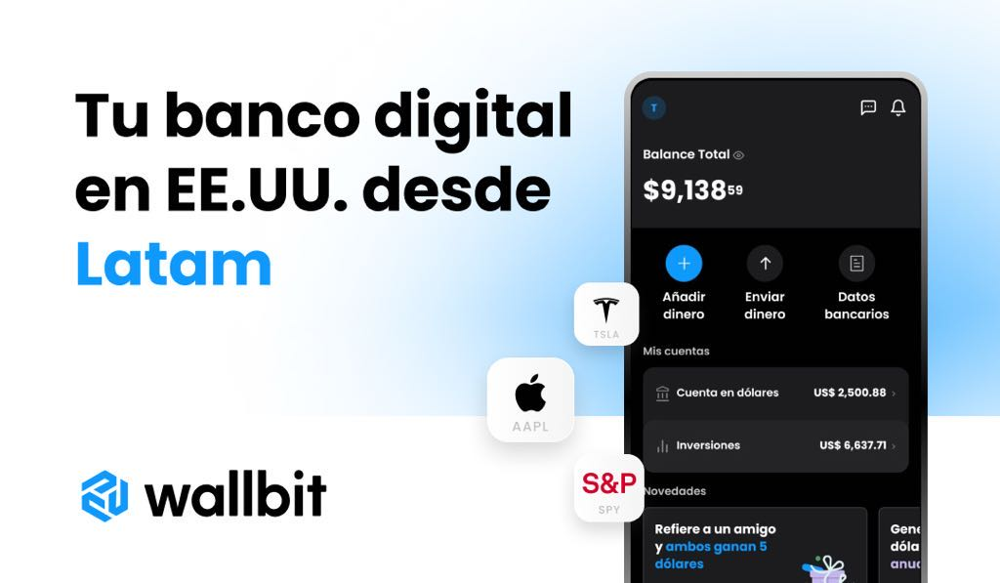

# Origen

El origen del dinero (de tú dinero)

Uno de los requisitos para invertir dinero es "tener dinero". Muchos creen que es algo simple, pero todo lo que tenemos debe tener un origen. Cómo llegó ese dinero a nosotros, lo tenemos que saber. Y no solo "saber", es poder probar que así es como decimos que llegó.

- Si fue un préstamo, habrá documentación respaldatoria
- Si es de un familiar, que te prestó el dinero; busca la forma de hacer firmar a ese familiar que el día "x" te realiza dicho prestamo de forma voluntaria (o te lo regala?) ... busca consejo profesional para que este documento pueda ser avalado por un contador público en caso de que una entidad bancaria te exija verificar el origen de los fondos.
- Si fue sueldo, debería haber documentación respaldatoria.
- Si fue por un trabajo, debes ser monotributista o facturar ese trabajo.
- Sea como sea, siempre debes poder probar de dónde viene el dinero.

Esto es muy importante, ya que el dinero que invertiremos para ganar más dinero puede ser cuestionado por entidades financieras y/o bancarias.

## Cómo invertir mi dinero

Lo llevas a una billetera o broker como Wallbit por ejemplo:

PD: colocando el Código de referido: `JT1MRD36` te regala $5 😃 

## Sigue con

<section class='cta show'>

<a href='#/c/trading'>TRADING</a>

</section>