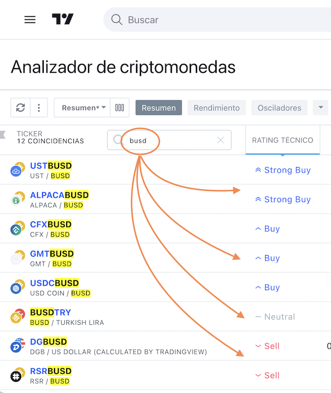

# Sentimiento del mercado :id=sentimiento

Cuando hacemos análisis del mercado, siempre es importante tener en cuenta ciertas páginas que nos brindan una suerte de indicadores del sentimiento del mercado. Así podemos saber cómo "siente" o cómo "ve" el mercado bajo una teoría de grandes números.

En esta página analizaremos indicadores de emociones. Por eso se dice que es un sentimiento de mercado, estas son emociones. En muchas oportunidades veremos que el mercado se comporta en contra de la lógica. Por más que los indicadores técnicos, por estudios matemáticos, proyecciones basadas en hechos históricos, demuestren que el mercado se tendría que comportar de otra forma, en muchas oportunidades veremos que se comporta de forma irracional. Es culpa de los sentimientos del mercado.

## Miedo y Codicia

- FEAR = Miedo
- GREED = Codicia

Esto se actualiza ahora, HOY estamos así:

¿Cómo se lee ésto? Por lo general, cuando hay "miedo" en el mercado, los precios bajan. Esto es así porque muchas personas por el miedo, venden. En cambio, cuando hay mucha codicia, las personas compran. Incluso cuando estamos en precios máximos, los niveles de codicia son más altos, y la gente sigue comprando (en contra de toda lógica). 

## Cambio distributivo en Binance

Si vamos al "Resumen de Mercados" en la sección [Mercados de Binance](https://www.binance.com/es/markets?ref=BRR737TH) veremos en tiempo real si el sentimiento es negativo (que el precio baja) o positivo (que el precio subirá). Pocas veces es neutral (que lateraliza)

## Analizador de Criptomonedas

La plataforma de análisis técnico por definición es TradingView, la misma tiene un sector en cada análisis de criptomonedas, que te da una forma de "señal técnica", de 5 niveles:

- Compra
- Compra Fuerte
- Neutral
- Venta
- Venta Fuerte

Un ejemplo del Crypto Screener:

El ["Crypto Screener" podemos verlo aquí](https://es.tradingview.com/crypto-screener/?share_your_love=waldd0), y en esta sección está la columna "Rating Técnico".
